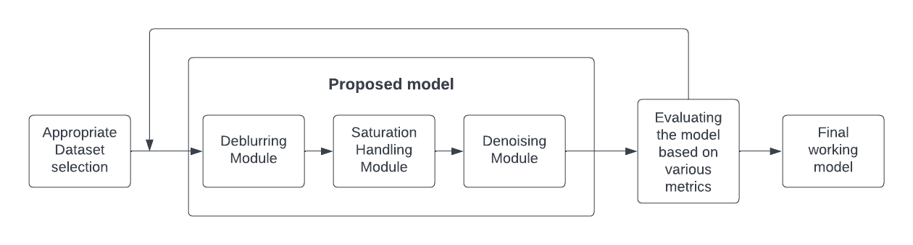
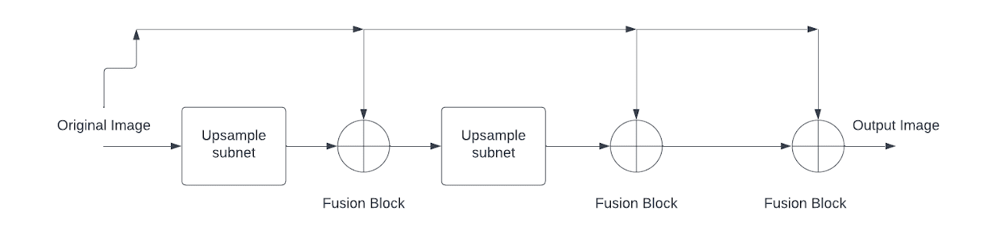
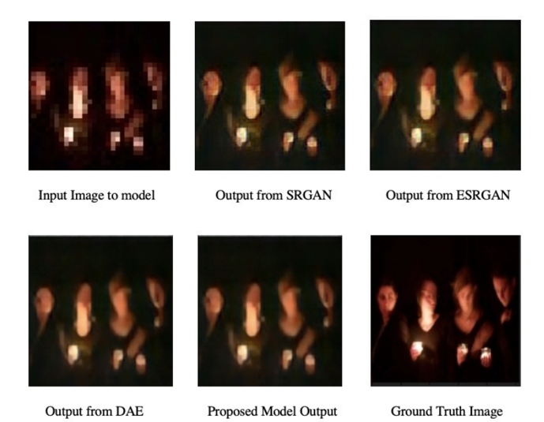
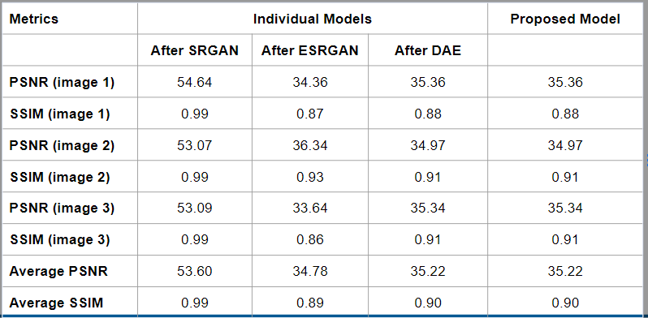

# Saturation Handling, Deblurring & Denoising
Deblurring and Denoising images with outliers(saturation) using the help of an optimum GAN module.

## Motivation
Images are often degraded due to various reasons apart from Blur. Most existing deblurring networks do not deal with other outliers in images such as Saturation and Noise even though these very commonly affect the quality of images. A solution to this problem has the potential of being used in various fields, one very important application being it's use in improving poor-quality CCTV footage.

## Main objectives:
1. Use the optimum GAN module for deblurring images: **SRGAN (Super Resolution GAN)**
2. Handle outliers (eg: saturation) while deblurring: **ESRGAN (Enhanced Super Resolution GAN)**
3. Use traditional denoising networks for image denoising: **DAE (Denoising Autoencoder)**
4. Combine all the three architectures to obtain the final working model.

## Design

## Structural modifications made to ESRGAN
1. A single ESRGAN structure can be used as an upsample subnet as it multiplies the size of the image while also improving the quality of the image.
2. Created a 2-layered ESRGAN structure. It was observed that if layered consecutively, it was successful in reducing the number of saturated pixels but was introducing additional noise into the image.
3. To combat the noise issue, fusion blocks were added in between that were able to reduce the noise to a certain extent.
4. The Denoising module was placed after the Saturation Handling module to further help with this issue.

## Results

